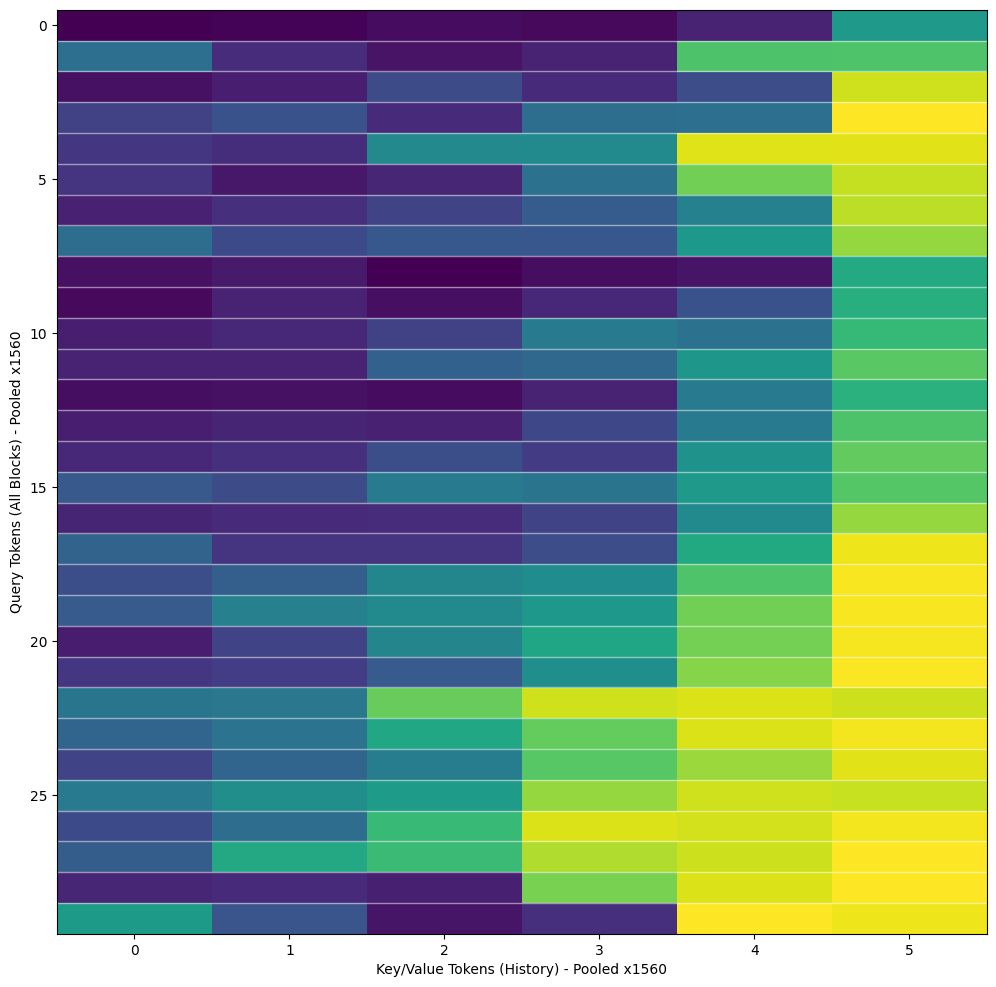
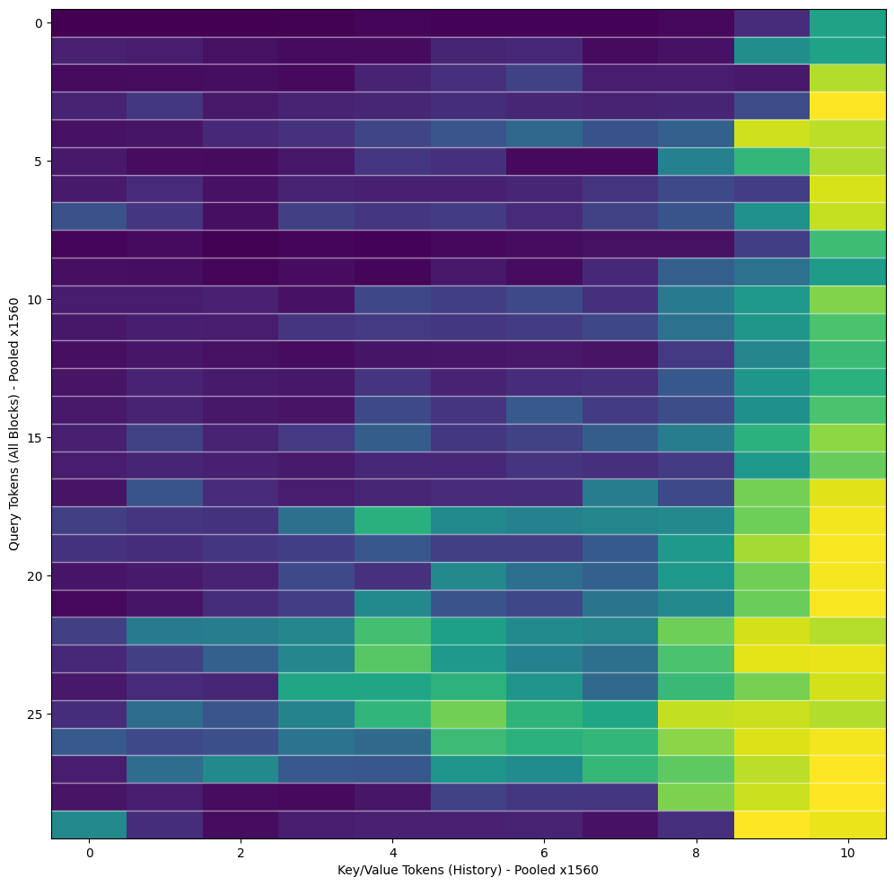
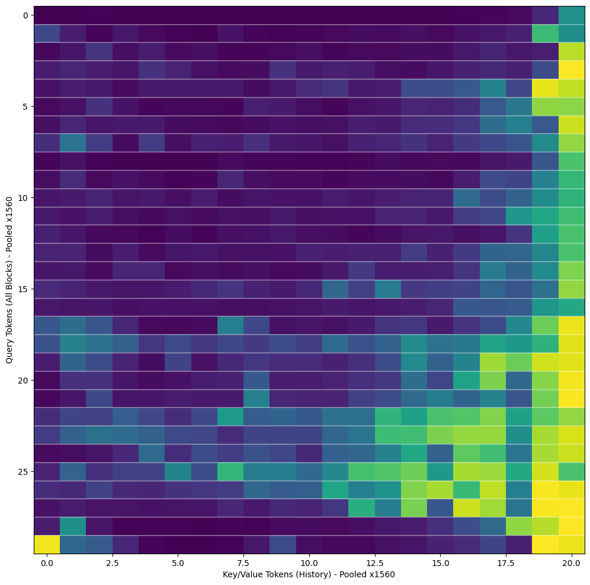
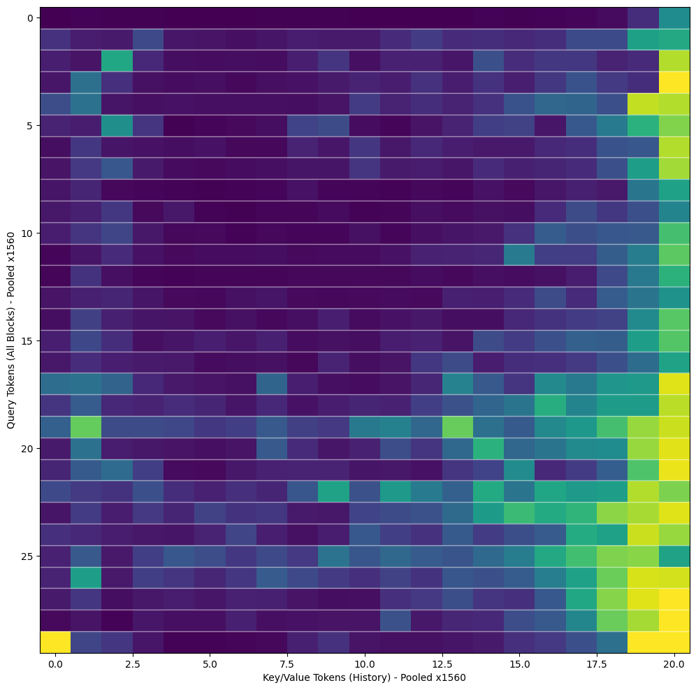

<p align="center">

<p>

<p align="center">
<h1 align="center">Towards Infinite-Long Video Generation</h1>
</p>


## Preliminary: Self-Forcing

Self Forcing trains autoregressive video diffusion models by **simulating the inference process during training**, performing autoregressive rollout with KV caching. It resolves the train-test distribution mismatch and enables **real-time, streaming video generation on a single RTX 4090** while matching the quality of state-of-the-art diffusion models.


## Difference with Self-Forcing: V-sink

> <b>TL;DR: (1) Treat the initially generated `sink_size` frames as V-sink; (2) Incorporate V-sink into training; (3) Apply RoPE operation after retrieving KV cache. </b>

We found that the Self-Forcing repository has implemented `sink_size`, but the specific usage method is not discussed in their paper.  By printing the attention map, we did not observe phenomena similar to the [attention_sink](https://github.com/mit-han-lab/streaming-llm/tree/main) in LLMs. The experimental configuration for the attention map below is in `configs/self_forcing_dmd_frame1.yaml`. 

<table style="text-align: center; margin-left: auto; margin-right: auto;">
<tr>
<td>
</img>
</td>
<td>
</img>
</td>
<td>
</img>
</td>
<td>
</img>
</td>
</tr>

<tr>
<td style="text-align: center;">frame 5</td>
<td>frame 10</td>
<td>frame 20</td>
<td>frame 40</td>
</tr>
</table>

When `sink_size = 1` and inference exceeds the training length (> 20 frame), it can be observed that the model assigns a larger attention weight to the frame serving as the sink only in the final block. However, in experiments, we found that even without the appearance of an attention map similar to that in LLMs, using the first `sink_size` frames as sinks can **significantly improve visual quality**.

> We interpret this as the first `sink_size` frames providing a larger memory context, enabling the model to access earlier memories, which helps mitigate exposure bias (AKA drift).

Moreover, the implementation in the Self-Forcing repository applies the RoPE operation before storing the KV cache. We observed that when the inference length becomes too long, the effectiveness of the sink diminishes. Therefore, adopting an approach similar to [streamingLLM](https://github.com/mit-han-lab/streaming-llm/tree/main), we incorporated the sink frame (which we refer to as `V-sink`) into the training process and **moved the RoPE operation to after retrieving the KV cache**. The specific implementation can be found in the `CausalWanSelfAttention` class in `wan/modules/causal_model.py`.

> V-sink differs from attention sink in LLMs. V-sink is a complete frame, whereas in LLMs the sink is the first token of the sequence (typically \<bos\>). Thus, their working mechanisms are distinct.  


## Comparison

We compared the inference performance of:
  - the original Self-Forcing implementation (Left)
  - Self-Forcing w/ V-sink (Mid)
  - **Infinite-Forcing (Right)**


<video src="https://github.com/user-attachments/assets/6c8bc09d-5955-47af-a824-f45f4bf4b6ef" autoplay muted loop playsinline></video>

<video src="https://github.com/user-attachments/assets/5aca1280-e957-4124-9e56-c2d00f2b583b" autoplay muted loop playsinline></video>


## Gallery


<table style="text-align: left; margin-left: auto; margin-right: auto;">

<tr>
<td>
<video src="https://github.com/user-attachments/assets/9afefed1-e8a0-4f8d-9bb0-68800703ed22" autoplay muted loop playsinline></video>
</td>
<td>
<video src="https://github.com/user-attachments/assets/fbb029f8-ffba-474d-aa4f-7e32f342186c" autoplay muted loop playsinline></video>
</td>
</tr>

<tr>
<td>
<video src="https://github.com/user-attachments/assets/10046e9e-f5e4-4591-b3a4-7fd0932b4465" autoplay muted loop playsinline></video>
</td>
<td>
<video src="https://github.com/user-attachments/assets/4cf89920-21d2-4b38-b1e5-13eea321d4c7" autoplay muted loop playsinline></video>
</td>
</tr>

<tr>
<td>
<video src="https://github.com/user-attachments/assets/5f15141d-5d03-4dfa-8ec5-4043a61fae94" autoplay muted loop playsinline></video>
</td>
<td>
<video src="https://github.com/user-attachments/assets/e5f845a4-eede-4b70-8bbd-d96585e842cc" autoplay muted loop playsinline></video>
</td>
</tr>

<tr>
<td>
<video src="https://github.com/user-attachments/assets/0126f5f2-1cce-4cc6-a724-223cb2d816b4" autoplay muted loop playsinline></video>
</td>
<td>
<video src="https://github.com/user-attachments/assets/47bed94a-413f-428a-b72d-a976eda303e3" autoplay muted loop playsinline></video>
</td>
</tr>

</table>


## Application: interactive video generation

Since Infinite-Forcing / Self-Forcing ultimately produces a causal autoregressive video generation model, we can modify the text prompts during the generation process to control the video output in real-time.


## Installation
Create a conda environment and install dependencies:
```
conda create -n self_forcing python=3.10 -y
conda activate self_forcing
pip install -r requirements.txt
pip install flash-attn --no-build-isolation
python setup.py develop
```

## Quick Start
### Download checkpoints
```
huggingface-cli download Wan-AI/Wan2.1-T2V-1.3B --local-dir-use-symlinks False --local-dir wan_models/Wan2.1-T2V-1.3B
huggingface-cli download SOTAMak1r/Infinite-Forcing --local-dir checkpoints/
```

### CLI Inference
Example inference script using the chunk-wise autoregressive checkpoint trained with DMD:
```
python inference.py \
    --config_path configs/self_forcing_dmd_vsink1.yaml \
    --output_folder videos/self_forcing_dmd_vsink1 \
    --checkpoint_path path/to/your/pt/checkpoint.pt \
    --data_path prompts/MovieGenVideoBench_extended.txt \
    --use_ema
```

## Training
### Download text prompts and ODE initialized checkpoint 

Follow Self-Forcing

### Infinite Forcing Training with V-sink
```
torchrun --nnodes=2 --nproc_per_node=8 \
  --rdzv_backend=c10d \
  --rdzv_endpoint $MASTER_ADDR \
  train.py \
  --config_path configs/self_forcing_dmd_vsink1.yaml \
  --logdir logs/self_forcing_dmd_vsink1 \
  --disable-wandb
```

Due to resource constraints, we trained the model using 16 A800 GPUs with a gradient accumulation of 4 to simulate the original Self-Forcing configuration.

## Discussion
- [2025.9.30] We observed that incorporating V-sink results in a reduction of dynamic motion in the generated frames, and this issue worsens as training steps increase. We hypothesize that this occurs because the base model's target distribution includes a portion of static scenes, causing the model to "cut corners" by learning that static videos yield lower loss values—ultimately converging to a suboptimal sub-distribution. Additionally, the introduction of V-sink tends to make subsequent videos overly resemble the initial frames (Brainstorm: Could this potentially serve as a memory mechanism for video generation based on world models?).  

We will continue to update! Stay tuned!

## Acknowledgements
This codebase is built on top of the open-source implementation of [CausVid](https://github.com/tianweiy/CausVid) by [Tianwei Yin](https://tianweiy.github.io/) and the [Wan2.1](https://github.com/Wan-Video/Wan2.1) repo.


## Citation
If you find this codebase useful for your research, please kindly cite:
```
@article{huang2025selfforcing,
  title={Self Forcing: Bridging the Train-Test Gap in Autoregressive Video Diffusion},
  author={Huang, Xun and Li, Zhengqi and He, Guande and Zhou, Mingyuan and Shechtman, Eli},
  journal={arXiv preprint arXiv:2506.08009},
  year={2025}
}

```
